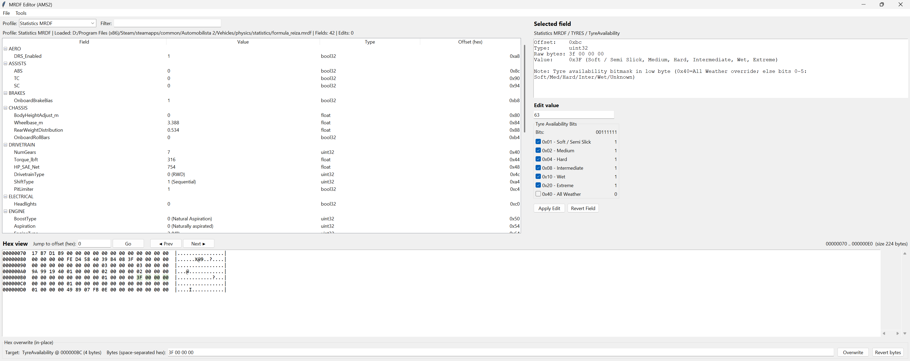

# MRDF Multi Editor (AMS2 / Project CARS 2)

A lightweight **Tkinter-based MRDF editor + hex viewer/editor** for **Automobilista 2 / Project CARS 2** style `.mrdf` binaries.

It supports **multiple MRDF “profiles”** (definition sets) and performs **in-place edits only** — **file size must not change**.

---

## Features

- **Open / Save / Save As** MRDF binaries
- **Profile system** (currently):
  - **Statistics MRDF** (vehicle stats/feature flags)
  - **Physics Tweaker MRDF** (physics/AI/assists tuning values)
- **Auto profile detection** based on filename hints + value heuristics
- **Field browser** grouped by section with live **filter/search**
- **Typed editing**:
  - `float`, `int32`, `uint32`, `bool32`, `uint8`
  - Enum dropdowns where mappings exist
- **Tyre Availability bitmask editor**
  - Checkbox UI for each tyre compound bit
  - Shows the combined 8-bit binary string (e.g. `00110001`)
- **Hex view pane**
  - Paginated hex dump with ASCII column
  - Jump to offset
  - Highlights the selected field’s bytes
- **Hex overwrite editor**
  - Overwrite selected field bytes *exactly* (size-checked)
  - Revert selected byte range back to original

